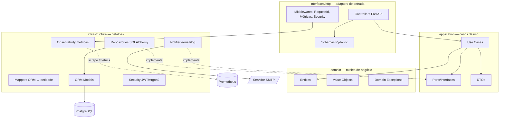
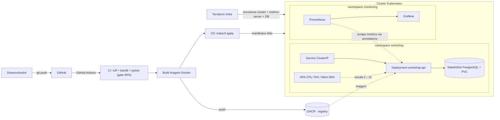
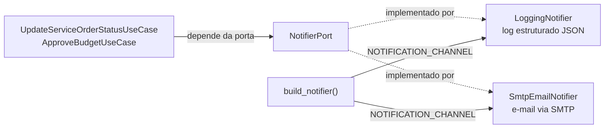

# Workshop Management API

[](https://github.com/Figueiraa/workshop-management-api/actions/workflows/ci-cd.yml)

-success)


Sistema integrado para gestão de oficina mecânica (ordens de serviço, veículos, clientes e
controle de peças), construído com **FastAPI** seguindo **Clean Architecture**.

Este repositório contém a evolução da **Fase 2** do Tech Challenge: refatoração do código para
Clean Architecture com testes automatizados, novas APIs de Ordem de Serviço e infraestrutura
moderna — containerização (Docker), orquestração (Kubernetes com autoescalonamento),
observabilidade (Prometheus + Grafana), Infraestrutura como Código (Terraform) e pipeline de CI/CD.

🎥 **Vídeo demonstrativo (≤ 15 min):** https://youtu.be/LKsReHnUPCw

## Objetivos da Fase 2

- **Qualidade de código:** Clean Code + Clean Architecture + testes automatizados.
- **Resiliência e escalabilidade:** Kubernetes com Horizontal Pod Autoscaler (HPA).
- **Observabilidade:** métricas Prometheus, dashboards Grafana, alertas e logs estruturados.
- **Automação:** provisionamento via Terraform e deploy via CI/CD.
- **Evolução funcional:** abertura e consulta de OS, aprovação de orçamento (aprovar/recusar),
  listagem ordenada por prioridade e notificação de mudança de status.

---

## Mapa dos requisitos — onde encontrar cada entrega

| Requisito | Onde está | Como verificar em 1 comando |
| :--- | :--- | :--- |
| **Testes automatizados** | [`tests/`](tests/) — 176 testes (89 de unidade + 87 de integração) | `pytest` → cobertura **96%**, gate de 90% |
| **Cobertura de testes** | Relatórios gerados em `htmlcov/`, `coverage.xml`, `report/junit.xml` | `pytest && python scripts/test_report_summary.py` |
| **Monitoramento e métricas** | [`app/infrastructure/observability/`](app/infrastructure/observability/) + [`monitoring/`](monitoring/) + [`k8s/monitoring/`](k8s/monitoring/) | `curl localhost:8000/metrics` · Grafana em `localhost:3000` |
| **Notificação por e-mail/log** | [`app/infrastructure/notifications/notifier.py`](app/infrastructure/notifications/notifier.py) (porta em [`ports/notifier.py`](app/application/ports/notifier.py)) | `PATCH /api/v1/service-orders/{id}/status` → log/e-mail + métrica |
| **Documentação da API** | OpenAPI gerado pela aplicação | `localhost:8000/docs` (Swagger) e `/redoc` |
| **Clean Architecture** | [`app/domain`](app/domain) · [`app/application`](app/application) · [`app/infrastructure`](app/infrastructure) · [`app/interfaces`](app/interfaces) | ver [Arquitetura](#arquitetura-da-aplicação) |
| **Containerização** | [`Dockerfile`](Dockerfile), [`docker-compose.yml`](docker-compose.yml) | `docker compose up --build` |
| **Orquestração + escalabilidade** | [`k8s/`](k8s/) (Deployment, Service, HPA 2→10) | `kubectl apply -k k8s/` |
| **Infraestrutura como código** | [`infra/`](infra/) (Terraform) | `terraform apply` |
| **CI/CD** | [`.github/workflows/ci-cd.yml`](.github/workflows/ci-cd.yml) | lint → bandit → testes → build → deploy |

> **Tudo em um comando:** `docker compose up --build` sobe API + PostgreSQL + Prometheus + Grafana.
> Depois: Swagger em `:8000/docs`, métricas em `:8000/metrics`, Grafana em `:3000`.

---

## Arquitetura da aplicação

Organização em camadas concêntricas, com a **regra de dependência apontando sempre para o
domínio** — o núcleo de negócio não conhece framework, banco ou protocolo.



**Componentes principais:**

| Camada | Pasta | Responsabilidade |
| :--- | :--- | :--- |
| Domínio | `app/domain` | Entidades, value objects e regras de negócio puras (sem framework) |
| Aplicação | `app/application` | Casos de uso, ports (interfaces) e DTOs |
| Infraestrutura | `app/infrastructure` | Repositórios/ORM, banco, segurança, notificações, observabilidade, config |
| Interface | `app/interfaces/http` | Controllers, schemas, middlewares e tratamento de erros |

> **Por que métricas e notificações vivem na infraestrutura?** Ambas são detalhes técnicos.
> O caso de uso depende apenas da porta `NotifierPort`; quem decide entre e-mail e log é a
> configuração. As métricas de negócio são registradas pelos *adapters* (controllers), então
> `domain` e `application` continuam sem qualquer import de Prometheus — a regra de dependência
> permanece intacta.

---

## Infraestrutura provisionada e fluxo de deploy



- **Docker** empacota a aplicação (imagem multi-stage, usuário non-root, healthcheck).
- **Kubernetes** (`/k8s`) roda a API (2+ réplicas) e o PostgreSQL, com **HPA** escalando por CPU/memória.
- **Prometheus + Grafana** (`/k8s/monitoring`) coletam e exibem as métricas — os pods novos criados
  pelo HPA entram na coleta automaticamente, via *service discovery* por annotations.
- **Terraform** (`/infra`) provisiona o cluster (kind local, ou cloud), o `metrics-server` e o banco.
- **CI/CD** (GitHub Actions) testa, publica a imagem no GHCR e aplica os manifestos no cluster.

---

## Stack

Python 3.11 · FastAPI · SQLAlchemy 2 (async) · PostgreSQL 16 · PyJWT · Argon2 (pwdlib) ·
prometheus-client · Docker · Kubernetes · Prometheus · Grafana · Terraform · GitHub Actions ·
pytest · ruff · bandit.

## Estrutura do projeto

```
app/
├── main.py                  # Composition root (FastAPI, middlewares, DI, health, /metrics)
├── domain/                  # entities, value_objects, exceptions
├── application/             # use_cases, ports (inclui NotifierPort), dtos
├── infrastructure/          # persistence (models, repositories, mappers, gateways), security,
│                            # notifications (log/SMTP), observability (métricas), config, logging
└── interfaces/http/         # controllers, schemas, dependencies, exception_handlers, middleware
tests/
├── unit/                    # domínio, casos de uso, notificador, métricas, validadores  (89)
└── integration/             # endpoints ponta a ponta, health e /metrics                 (87)
monitoring/                  # Prometheus (scrape + alertas) e Grafana (datasource + dashboard)
k8s/                         # manifestos da aplicação (Deployment, Service, HPA, Postgres, ...)
└── monitoring/              # stack de observabilidade no cluster (Prometheus + Grafana)
infra/                       # Terraform (cluster + metrics-server + PostgreSQL)
scripts/                     # utilitários (resumo dos relatórios de teste)
.github/workflows/           # pipeline de CI/CD
```

---

## Execução local (sem Docker)

Roda a API direto na sua máquina usando **SQLite** — não precisa de banco nem de nenhum serviço externo.

**Pré-requisitos:** Python 3.11+ e Git.

**1. Clone o repositório e entre na pasta**
```bash
git clone https://github.com/Figueiraa/workshop-management-api.git
cd workshop-management-api
```

**2. Crie o ambiente virtual**
```bash
python -m venv .venv
```

**3. Ative o ambiente virtual**

- **Windows (PowerShell):**
  ```powershell
  .venv\Scripts\Activate.ps1
  ```
  > Se aparecer *"a execução de scripts foi desabilitada"*, rode uma vez e tente de novo:
  > `Set-ExecutionPolicy -Scope Process -ExecutionPolicy Bypass`
- **Linux / macOS:**
  ```bash
  source .venv/bin/activate
  ```
  ✅ O início da linha do terminal passa a mostrar `(.venv)`.

**4. Instale as dependências**
```bash
pip install -r requirements.txt
```

**5. Crie o arquivo de configuração**
```bash
cp .env.example .env
```
O `.env` padrão já vem com SQLite (`sqlite+aiosqlite:///./workshop.db`) — nada mais a configurar.

**6. Suba a aplicação**
```bash
uvicorn app.main:app --reload
```
✅ Deve aparecer no terminal: `Uvicorn running on http://127.0.0.1:8000`.

**7. Acesse e verifique**
- Swagger (documentação interativa): **http://localhost:8000/docs**
- Health check: **http://localhost:8000/health** → deve retornar `{"status":"ok"}`
- Métricas: **http://localhost:8000/metrics** → texto no formato Prometheus

**8. Primeiro uso (autenticação)**

As rotas administrativas exigem login. No Swagger:
1. Cadastre um usuário em **`POST /api/v1/auth/register`** (ex.: `{"username":"admin","email":"admin@teste.com","password":"senha123"}`).
2. Clique em **Authorize** (cadeado), informe o mesmo usuário e senha, e confirme.
3. Pronto — agora você pode consumir todas as rotas `/api/v1/...`.

> Para encerrar a aplicação, pressione **Ctrl+C** no terminal.

## Execução com Docker Compose

Sobe **API + PostgreSQL + Prometheus + Grafana** juntos, num ambiente próximo ao de produção —
ótimo para rodar sem instalar Python na máquina e para demonstrar o monitoramento.

**Pré-requisitos:** Docker + Docker Compose (o Docker Desktop já inclui os dois).

**1. Clone o repositório e entre na pasta** (se ainda não fez)
```bash
git clone https://github.com/Figueiraa/workshop-management-api.git
cd workshop-management-api
```

**2. Garanta que o Docker está rodando**

Abra o **Docker Desktop** e espere o status ficar **"Running"** (no Linux: `sudo systemctl start docker`).

**3. Suba o ambiente**
```bash
docker compose up --build
```
> Na primeira vez demora alguns minutos (baixa as imagens e constrói a aplicação). Não precisa de `.env`: o `compose` já traz valores padrão e aponta a API para o PostgreSQL.

**4. Aguarde ficar pronto**

O ambiente está no ar quando o log mostrar `Uvicorn running on http://0.0.0.0:8000` (e o banco, `database system is ready to accept connections`).

**5. Acesse e verifique**

| Serviço | URL | O que esperar |
| :--- | :--- | :--- |
| Swagger | http://localhost:8000/docs | Documentação interativa da API |
| Health | http://localhost:8000/health | `{"status":"ok"}` |
| Métricas | http://localhost:8000/metrics | Texto no formato Prometheus |
| Prometheus | http://localhost:9090 | *Status → Targets*: `workshop-api` **UP** |
| Grafana | http://localhost:3000 | Dashboard **Workshop API — Observabilidade** (`admin`/`admin`) |

**6. Primeiro uso (autenticação)**

Mesmo fluxo da execução local: cadastre um usuário em **`POST /api/v1/auth/register`**, clique em **Authorize** e informe o usuário/senha.

**7. Parar e limpar**
- Pare com **Ctrl+C**. Para remover os containers:
  ```bash
  docker compose down
  ```
- Para remover **também os dados** (banco, histórico de métricas): `docker compose down -v`

> Só quer a API, sem monitoramento? `docker compose up api db`

---

## Testes automatizados

A suíte tem **176 testes** (89 de unidade e 87 de integração) e cobre **96% das linhas** da
aplicação. O gate mínimo de **90%** está em [`pytest.ini`](pytest.ini): abaixo disso o comando
`pytest` falha, e a pipeline de CI reprova o commit.

### Rodar

```bash
pytest                       # suíte completa + cobertura + relatórios (gate de 90%)
pytest -m unit               # só os testes de unidade      (rápidos, sem I/O)
pytest -m integration        # só os testes de integração   (HTTP ponta a ponta)
pytest -q --no-cov           # execução rápida, sem medir cobertura
pytest tests/unit/test_notifier.py -v      # um arquivo específico, detalhado
```

Saída esperada ao final:

```
Required test coverage of 90% reached. Total coverage: 96.19%
176 passed
```

### Relatórios gerados

Cada execução de `pytest` produz três relatórios (todos ignorados pelo Git):

| Arquivo | Para quê |
| :--- | :--- |
| `htmlcov/index.html` | Relatório de cobertura navegável — abra no navegador e clique arquivo a arquivo |
| `coverage.xml` | Formato Cobertura, consumível por Codecov/SonarQube |
| `report/junit.xml` | Resultado dos testes em JUnit XML, lido pela CI |

Resumo rápido no terminal:

```bash
pytest && python scripts/test_report_summary.py
```

```
## Testes automatizados

| Métrica | Valor |
| :--- | ---: |
| Testes executados | 176 |
| Aprovados | 176 |
| Falhas | 0 |
| Cobertura de linhas | 96.19% |
| Gate de cobertura | 90% (atingido) |
```

> Na CI, esse mesmo quadro aparece no **resumo da execução** do GitHub Actions, e os três
> relatórios ficam disponíveis como *artifact* (`test-and-coverage-reports`) por 30 dias.

### O que é testado

| Suíte | Arquivo | Cobre |
| :--- | :--- | ---: |
| Unidade — domínio | [`tests/unit/test_service_order_entity.py`](tests/unit/test_service_order_entity.py) | Máquina de estados da OS: transições válidas, inválidas e timestamps |
| Unidade — casos de uso | [`tests/unit/test_use_cases.py`](tests/unit/test_use_cases.py) | Regras dos 11 casos de uso com repositórios reais (SQLite em memória) |
| Unidade — casos de uso (mocks) | [`tests/unit/test_use_cases_mocked.py`](tests/unit/test_use_cases_mocked.py) | Colaboração com as *ports*, isolando a infraestrutura |
| Unidade — notificações | [`tests/unit/test_notifier.py`](tests/unit/test_notifier.py) | Canal de log, envio SMTP, falha de envio, seleção do canal |
| Unidade — métricas | [`tests/unit/test_metrics.py`](tests/unit/test_metrics.py) | Coletores, helpers e formato de exposição |
| Unidade — validadores | [`tests/unit/test_validators.py`](tests/unit/test_validators.py) | CPF/CNPJ e placa (Mercosul e antiga) |
| Integração — autenticação | [`tests/integration/test_auth.py`](tests/integration/test_auth.py) | Registro, login, token inválido/expirado, rota protegida |
| Integração — CRUDs | [`test_clients`](tests/integration/test_clients.py) · [`test_vehicles`](tests/integration/test_vehicles.py) · [`test_service_types`](tests/integration/test_service_types.py) · [`test_parts`](tests/integration/test_parts.py) | CRUD completo, validações e erros 404/409/422 |
| Integração — ordens de serviço | [`tests/integration/test_service_orders.py`](tests/integration/test_service_orders.py) | Abertura, listagem por prioridade, status, orçamento, baixa de estoque |
| Integração — observabilidade | [`tests/integration/test_metrics.py`](tests/integration/test_metrics.py) | `/metrics`, instrumentação HTTP e métricas de negócio |
| Integração — health | [`tests/integration/test_health.py`](tests/integration/test_health.py) | `/health`, `/health/live`, `/health/ready` |

### Cobertura por camada

| Camada | Cobertura |
| :--- | ---: |
| `domain` (entidades, value objects, exceções) | **100%** |
| `application` (casos de uso, ports, DTOs) | **94%** |
| `infrastructure/notifications` | **100%** |
| `infrastructure/observability` | **100%** |
| `infrastructure/persistence` | **98%** |
| `infrastructure/security` | **100%** |
| `interfaces/http` | **96%** |
| **Total** | **96%** |

Os testes usam **SQLite em memória**, recriado a cada teste pelas fixtures de
[`tests/conftest.py`](tests/conftest.py) — não é preciso subir banco nem Docker para rodar a suíte.

---

## Observabilidade e monitoramento

A API expõe métricas no formato **Prometheus** em **`GET /metrics`** (endpoint público, sem
autenticação, como esperam os coletores). Não há configuração obrigatória: a instrumentação
já sobe junto com a aplicação.

```bash
curl http://localhost:8000/metrics | grep workshop_
```

### Métricas expostas

**Técnicas — método RED (Rate, Errors, Duration)**, coletadas pelo
[`MetricsMiddleware`](app/interfaces/http/middleware.py):

| Métrica | Tipo | Labels | Para quê |
| :--- | :--- | :--- | :--- |
| `workshop_http_requests_total` | Counter | `method`, `endpoint`, `status_code` | Throughput e taxa de erro por rota |
| `workshop_http_request_duration_seconds` | Histogram | `method`, `endpoint` | Latência p50/p95/p99 (SLO: p95 < 300 ms) |
| `workshop_http_requests_in_progress` | Gauge | `method`, `endpoint` | Concorrência — subsídio para o HPA |
| `workshop_http_exceptions_total` | Counter | `method`, `endpoint`, `exception` | Erros não tratados, por tipo |

**De negócio**, registradas pelos controllers e pelo notificador:

| Métrica | Tipo | Labels | Para quê |
| :--- | :--- | :--- | :--- |
| `workshop_service_orders_opened_total` | Counter | — | Volume de OS abertas |
| `workshop_service_order_status_transitions_total` | Counter | `status` | Fluxo das OS pelo funil de status |
| `workshop_budget_approvals_total` | Counter | `result` (`approved`/`refused`) | Taxa de aprovação de orçamento |
| `workshop_notifications_total` | Counter | `channel`, `result` | Saúde do serviço de notificação |
| `workshop_app_info` | Gauge | `name`, `version` | Versão em execução (útil no deploy) |

> O label `endpoint` usa o **template da rota** (`/api/v1/service-orders/{order_id}`) e não a URL
> concreta — decisão deliberada para não explodir a cardinalidade das séries temporais com um
> label por identificador. Requisições sem rota correspondente caem em `unmatched`.
> Isso é verificado por teste em [`tests/integration/test_metrics.py`](tests/integration/test_metrics.py).

### Dashboard e alertas

Suba tudo com `docker compose up --build` e acesse:

- **Prometheus** → http://localhost:9090
  - *Status → Targets*: o alvo `workshop-api` deve estar **UP**.
  - *Alerts*: as 6 regras de [`monitoring/prometheus/rules/alerts.yml`](monitoring/prometheus/rules/alerts.yml).
- **Grafana** → http://localhost:3000 (`admin` / `admin`)
  - Pasta **Workshop** → dashboard **Workshop API — Observabilidade**, provisionado
    automaticamente a partir de [`monitoring/grafana/dashboards/workshop-api.json`](monitoring/grafana/dashboards/workshop-api.json).

O dashboard tem duas seções: **Saúde e SLO** (disponibilidade, req/s, taxa de erro 5xx,
latência p95, requisições em voo, endpoints mais lentos, exceções) e **Indicadores de negócio**
(OS abertas, orçamentos aprovados/recusados, transições de status, notificações por canal).

**Alertas configurados:**

| Alerta | Dispara quando | Severidade |
| :--- | :--- | :--- |
| `ApiIndisponivel` | Alvo sem resposta há 1 min | crítico |
| `TaxaDeErro5xxAlta` | > 5% de 5xx por 5 min | crítico |
| `LatenciaP95Degradada` | p95 > 300 ms por 10 min | atenção |
| `ExcecoesNaoTratadas` | Qualquer exceção não tratada em 10 min | atenção |
| `FalhaNoEnvioDeNotificacoes` | > 3 falhas de envio em 15 min | atenção |
| `NenhumaOsAbertaEmHorarioComercial` | Nenhuma OS aberta em 2 h | informativo |

**Gerar tráfego para ver os gráficos se moverem:**

```bash
# 200 requisições ao health check
for i in $(seq 1 200); do curl -s localhost:8000/health > /dev/null; done
```

```powershell
# Windows (PowerShell)
1..200 | ForEach-Object { Invoke-WebRequest -Uri http://localhost:8000/health -UseBasicParsing | Out-Null }
```

### No Kubernetes

O Deployment já traz as annotations de scrape, então o Prometheus **descobre os pods sozinho** —
inclusive as réplicas novas criadas pelo HPA:

```yaml
annotations:
  prometheus.io/scrape: "true"
  prometheus.io/port: "8000"
  prometheus.io/path: /metrics
```

Para subir a stack de observabilidade no cluster (namespace `monitoring`):

```bash
./k8s/monitoring/deploy.sh          # Linux / macOS / Git Bash
.\k8s\monitoring\deploy.ps1         # Windows (PowerShell)
```

Detalhes, acesso e a variante com Prometheus Operator (`ServiceMonitor`) em
[`k8s/monitoring/README.md`](k8s/monitoring/README.md).

### Logs estruturados

Além das métricas, todo log sai em **JSON** ([`logging_config.py`](app/infrastructure/logging_config.py))
com `timestamp`, `level`, `logger`, `message` e `request_id` — pronto para ELK, Datadog ou
CloudWatch. O `request_id` vem do header `X-Request-ID` (gerado quando ausente) e é devolvido na
resposta, permitindo correlacionar uma requisição do cliente com todos os logs que ela produziu.

```json
{"timestamp":"2025-01-15T10:32:11-0300","level":"INFO","logger":"workshop.notifications",
 "message":"Notificação de status da OS OS-000123 -> EM_EXECUCAO (destinatário: cliente@email.com)",
 "request_id":"4f2b8c1e-..."}
```

---

## Notificações de mudança de status

Quando o status de uma OS muda — seja por `PATCH /service-orders/{id}/status`, seja pela
aprovação/recusa do orçamento — o cliente é notificado automaticamente.

### Como está desenhado

A camada de aplicação depende apenas da porta
[`NotifierPort`](app/application/ports/notifier.py); a escolha do canal é um detalhe de
infraestrutura resolvido por configuração:



| Canal | Classe | Quando é usado |
| :--- | :--- | :--- |
| **Log** | `LoggingNotifier` | Padrão. Registra a notificação como log JSON — serve de trilha de auditoria |
| **E-mail** | `SmtpEmailNotifier` | Quando há servidor SMTP configurado. Envia o aviso ao e-mail do cliente |

### Configurar

```bash
# .env — canal de log (padrão, nada a fazer)
NOTIFICATION_CHANNEL=auto

# .env — canal de e-mail
NOTIFICATION_CHANNEL=email
SMTP_HOST=smtp.gmail.com
SMTP_PORT=587
SMTP_USER=usuario@gmail.com
SMTP_PASSWORD=senha-de-app
SMTP_FROM=no-reply@oficina.com.br
```

`NOTIFICATION_CHANNEL` aceita `auto` (e-mail se houver `SMTP_HOST`, senão log), `log` ou `email`.

### Ver funcionando

**Canal de log** — mude o status de uma OS e observe o terminal da API:

```json
{"timestamp":"2025-01-15T10:32:11-0300","level":"INFO","logger":"workshop.notifications",
 "message":"Notificação de status da OS OS-000123 -> EM_EXECUCAO (destinatário: cliente@email.com)",
 "request_id":"4f2b8c1e-..."}
```

**Canal de e-mail sem servidor real** — suba um MailHog e veja o e-mail chegar na caixa de entrada
falsa em http://localhost:8025:

```bash
docker run -d -p 1025:1025 -p 8025:8025 mailhog/mailhog
# no .env: NOTIFICATION_CHANNEL=email  SMTP_HOST=localhost  SMTP_PORT=1025  SMTP_USE_TLS=false
```

**Nas métricas** — cada notificação incrementa `workshop_notifications_total`:

```bash
curl -s localhost:8000/metrics | grep workshop_notifications_total
# workshop_notifications_total{channel="log",result="sent"} 3.0
```

### Garantias

- **A notificação nunca derruba o fluxo de negócio.** Uma falha de SMTP é registrada em log
  (`level: ERROR`) e contabilizada como `result="failed"`, mas a resposta da API continua `200` —
  a OS já foi atualizada com sucesso quando a notificação é disparada.
- **O envio não bloqueia o event loop.** `smtplib` é síncrono, então o envio roda em thread
  separada via `asyncio.to_thread`.
- **Cliente sem e-mail cadastrado** gera log de aviso e métrica `result="skipped"`, sem erro.

Tudo isso é coberto por testes em [`tests/unit/test_notifier.py`](tests/unit/test_notifier.py).

---

## Deploy em Kubernetes

Requisitos: um cluster (kind/minikube), `kubectl` e `metrics-server` (para o HPA).

```bash
# imagem no cluster local (kind):
docker build -t workshop-management-api:latest .
kind load docker-image workshop-management-api:latest

# aplica tudo (namespace, config, secret, postgres, api, service, hpa):
kubectl apply -k k8s/

kubectl -n workshop rollout status deployment/workshop-api
kubectl -n workshop port-forward svc/workshop-api 8000:80   # Swagger em http://localhost:8000/docs

# stack de observabilidade (Prometheus + Grafana):
./k8s/monitoring/deploy.sh
```

Detalhes e teste de escalabilidade em [`k8s/README.md`](k8s/README.md); monitoramento em
[`k8s/monitoring/README.md`](k8s/monitoring/README.md).

## Provisionamento com Terraform

Requisitos: Terraform >= 1.5, Docker (para o kind) e `kubectl`.

```bash
cd infra
cp terraform.tfvars.example terraform.tfvars   # ajuste a senha do banco
terraform init
terraform apply
export KUBECONFIG=$(terraform output -raw kubeconfig_path)
```

Provisiona cluster + `metrics-server` + PostgreSQL. Detalhes em [`infra/README.md`](infra/README.md).

## CI/CD

Pipeline em [`.github/workflows/ci-cd.yml`](.github/workflows/ci-cd.yml):

1. **CI** (push/PR):
   - `ruff` — lint de `app`, `tests` e `scripts`;
   - `bandit` — análise estática de segurança;
   - `pytest` — 176 testes com **gate de cobertura de 90%**;
   - resumo dos testes no *step summary* e relatórios publicados como *artifact*.
2. **Build** (push na `main`): build e push da imagem para o **GHCR**.
3. **Deploy** (push na `main`): aplica banco, aplicação e stack de monitoramento no cluster,
   seguido de *smoke test* em `/health` e `/metrics`.

Para habilitar o deploy: defina a variável de repositório `DEPLOY_ENABLED=true` e o secret
`KUBE_CONFIG` (kubeconfig em base64).

---

## Autenticação

As rotas administrativas exigem JWT (Bearer). No Swagger:

1. `POST /api/v1/auth/register` — cria um usuário administrativo.
2. **Authorize** (cadeado) → informe `username` e `password` → **Authorize**.

> `GET /api/v1/service-orders/{id}/status` e `POST /api/v1/service-orders/{id}/budget-approval`
> são **públicos** (consulta do cliente e notificação externa de aprovação).

## Endpoints (prefixo `/api/v1`)

| Método | Rota | Descrição |
| :--- | :--- | :--- |
| POST | `/auth/register` | Cadastrar usuário administrativo |
| POST | `/auth/login` | Autenticar e obter token |
| GET | `/auth/me` | Dados do usuário autenticado |
| GET / POST | `/clients` · `/clients/{id}` (GET/PATCH/DELETE) | CRUD de clientes |
| GET / POST | `/vehicles` · `/vehicles/{id}` (GET/PATCH/DELETE) | CRUD de veículos |
| GET | `/vehicles/client/{id}` | Veículos de um cliente |
| GET / POST | `/service-types` · `/service-types/{id}` (GET/PATCH/DELETE) | CRUD de serviços |
| GET / POST | `/parts` · `/parts/{id}` (GET/PATCH/DELETE) | CRUD de peças/insumos |
| POST | `/parts/{id}/stock` | Ajustar estoque |
| POST | `/service-orders` | **Abrir OS** (cliente/veículo/serviços/peças → ID único) |
| GET | `/service-orders` | **Listar** OS ativas (ordenadas por prioridade de status) |
| GET | `/service-orders/{id}` | Detalhar OS |
| PATCH | `/service-orders/{id}/status` | Atualizar status (**notifica o cliente**) |
| GET | `/service-orders/{id}/status` | **Consultar status** (público) |
| POST | `/service-orders/{id}/budget-approval` | **Aprovar/recusar orçamento** (público, notifica) |
| GET | `/service-orders/metrics/average-execution-time` | Tempo médio de execução |
| GET | `/health` · `/health/live` · `/health/ready` | Health checks (sem versão) |
| GET | `/metrics` | **Métricas Prometheus** (sem versão) |

### Status da OS

```
RECEBIDA → EM_DIAGNOSTICO → AGUARDANDO_APROVACAO → EM_EXECUCAO → FINALIZADA → ENTREGUE
                                     └── (recusa) → ORCAMENTO_RECUSADO
```

Ordem na listagem: **Em Execução > Aguardando Aprovação > Diagnóstico > Recebida**, mais antigas
primeiro; OS finalizadas, entregues e recusadas são omitidas (exclusão lógica).

Cada transição dispara uma notificação ao cliente e incrementa
`workshop_service_order_status_transitions_total`.

---

## Documentação das APIs (collection)

A especificação **OpenAPI/Swagger** é gerada automaticamente pela aplicação:

- Swagger UI: `http://localhost:8000/docs`
- ReDoc: `http://localhost:8000/redoc`
- OpenAPI JSON: `http://localhost:8000/openapi.json` (importável no Postman/Insomnia)

---

## Entregáveis da Fase 2

- 🎥 **Vídeo demonstrativo (≤ 15 min):** https://youtu.be/LKsReHnUPCw
  — demonstra o deploy da aplicação, a execução do CI/CD, o consumo das APIs e a
  escalabilidade automática (HPA sob carga).
- 📦 **Repositório** compartilhado com o usuário `soat-architecture`.
- 🖼️ **Desenho da arquitetura** (componentes, infraestrutura e fluxo de deploy): ver a seção
  [Arquitetura da aplicação](#arquitetura-da-aplicação) e
  [Infraestrutura provisionada e fluxo de deploy](#infraestrutura-provisionada-e-fluxo-de-deploy).
- ✅ **Testes automatizados:** 176 testes, 96% de cobertura, gate de 90% na CI — ver
  [Testes automatizados](#testes-automatizados).
- 📊 **Monitoramento e métricas:** endpoint `/metrics`, Prometheus, dashboard Grafana e 6 regras
  de alerta — ver [Observabilidade e monitoramento](#observabilidade-e-monitoramento).
- 📨 **Serviço de notificação:** canais de e-mail (SMTP) e log estruturado — ver
  [Notificações de mudança de status](#notificações-de-mudança-de-status).
