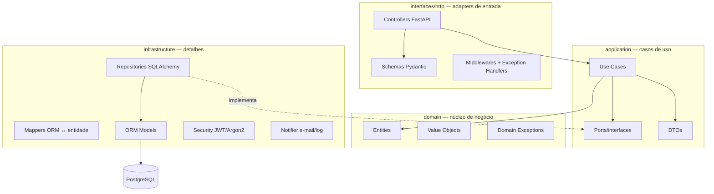
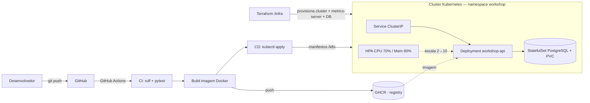

# Workshop Management API

Sistema integrado para gestão de oficina mecânica (ordens de serviço, veículos, clientes e
controle de peças), construído com **FastAPI** seguindo **Clean Architecture**.

Este repositório contém a evolução da **Fase 2** do Tech Challenge: refatoração do código para
Clean Architecture com testes automatizados, novas APIs de Ordem de Serviço e infraestrutura
moderna — containerização (Docker), orquestração (Kubernetes com autoescalonamento),
Infraestrutura como Código (Terraform) e pipeline de CI/CD.

🎥 **Vídeo demonstrativo (≤ 15 min):** https://youtu.be/LKsReHnUPCw

## Objetivos da Fase 2

- **Qualidade de código:** Clean Code + Clean Architecture + testes automatizados.
- **Resiliência e escalabilidade:** Kubernetes com Horizontal Pod Autoscaler (HPA).
- **Automação:** provisionamento via Terraform e deploy via CI/CD.
- **Evolução funcional:** abertura e consulta de OS, aprovação de orçamento (aprovar/recusar),
  listagem ordenada por prioridade e notificação de mudança de status.

---

## Arquitetura da aplicação

Organização em camadas concêntricas, com a **regra de dependência apontando sempre para o
domínio** — o núcleo de negócio não conhece framework, banco ou protocolo.



**Componentes principais:**

| Camada | Pasta | Responsabilidade |
| :--- | :--- | :--- |
| Domínio | `app/domain` | Entidades, value objects e regras de negócio puras (sem framework) |
| Aplicação | `app/application` | Casos de uso, ports (interfaces) e DTOs |
| Infraestrutura | `app/infrastructure` | Repositórios/ORM, banco, segurança, notificações, config |
| Interface | `app/interfaces/http` | Controllers, schemas, middlewares e tratamento de erros |

---

## Infraestrutura provisionada e fluxo de deploy



- **Docker** empacota a aplicação (imagem multi-stage, usuário non-root, healthcheck).
- **Kubernetes** (`/k8s`) roda a API (2+ réplicas) e o PostgreSQL, com **HPA** escalando por CPU/memória.
- **Terraform** (`/infra`) provisiona o cluster (kind local, ou cloud), o `metrics-server` e o banco.
- **CI/CD** (GitHub Actions) testa, publica a imagem no GHCR e aplica os manifestos no cluster.

---

## Stack

Python 3.11 · FastAPI · SQLAlchemy 2 (async) · PostgreSQL 16 · PyJWT · Argon2 (pwdlib) ·
Docker · Kubernetes · Terraform · GitHub Actions · pytest · ruff.

## Estrutura do projeto

```
app/
├── main.py                  # Composition root (FastAPI, middlewares, DI, health)
├── domain/                  # entities, value_objects, exceptions
├── application/             # use_cases, ports, dtos
├── infrastructure/          # persistence (models, repositories, mappers, gateways),
│                            # security, notifications, config, database, logging
└── interfaces/http/         # controllers, schemas, dependencies, exception_handlers, middleware
tests/
├── unit/                    # entidade de domínio, casos de uso (reais e com mocks)
└── integration/             # endpoints ponta a ponta
k8s/                         # manifestos Kubernetes (Deployment, Service, HPA, Postgres, ...)
infra/                       # Terraform (cluster + metrics-server + PostgreSQL)
.github/workflows/           # pipeline de CI/CD
```

---

## Execução local (sem Docker)

Requisitos: Python 3.11+.

```bash
python -m venv .venv
# Windows
.venv\Scripts\activate
# Linux/macOS
source .venv/bin/activate

pip install -r requirements.txt
cp .env.example .env          # o padrão já usa SQLite, sem serviços externos

uvicorn app.main:app --reload
```

API em `http://localhost:8000` · Swagger em `http://localhost:8000/docs`.

## Execução com Docker Compose

Requisitos: Docker + Docker Compose.

```bash
docker compose up --build
```

Sobe a API (porta 8000) e o PostgreSQL, com healthchecks. Não exige `.env` (há defaults
sobrescrevíveis no `compose`).

## Deploy em Kubernetes

Requisitos: um cluster (kind/minikube), `kubectl` e `metrics-server` (para o HPA).

```bash
# imagem no cluster local (kind):
docker build -t workshop-management-api:latest .
kind load docker-image workshop-management-api:latest

# aplica tudo (namespace, config, secret, postgres, api, service, hpa):
kubectl apply -k k8s/

kubectl -n workshop rollout status deployment/workshop-api
kubectl -n workshop port-forward svc/workshop-api 8000:80   # Swagger em http://localhost:8000/docs
```

Detalhes e teste de escalabilidade em [`k8s/README.md`](k8s/README.md).

## Provisionamento com Terraform

Requisitos: Terraform >= 1.5, Docker (para o kind) e `kubectl`.

```bash
cd infra
cp terraform.tfvars.example terraform.tfvars   # ajuste a senha do banco
terraform init
terraform apply
export KUBECONFIG=$(terraform output -raw kubeconfig_path)
```

Provisiona cluster + `metrics-server` + PostgreSQL. Detalhes em [`infra/README.md`](infra/README.md).

## CI/CD

Pipeline em [`.github/workflows/ci-cd.yml`](.github/workflows/ci-cd.yml):

1. **CI** (push/PR): `ruff` + `pytest` (com gate de cobertura).
2. **Build** (push na `main`): build e push da imagem para o **GHCR**.
3. **Deploy** (push na `main`): aplica banco e manifestos no cluster.

Para habilitar o deploy: defina a variável de repositório `DEPLOY_ENABLED=true` e o secret
`KUBE_CONFIG` (kubeconfig em base64).

---

## Autenticação

As rotas administrativas exigem JWT (Bearer). No Swagger:

1. `POST /api/v1/auth/register` — cria um usuário administrativo.
2. **Authorize** (cadeado) → informe `username` e `password` → **Authorize**.

> `GET /api/v1/service-orders/{id}/status` e `POST /api/v1/service-orders/{id}/budget-approval`
> são **públicos** (consulta do cliente e notificação externa de aprovação).

## Endpoints (prefixo `/api/v1`)

| Método | Rota | Descrição |
| :--- | :--- | :--- |
| POST | `/auth/register` | Cadastrar usuário administrativo |
| POST | `/auth/login` | Autenticar e obter token |
| GET | `/auth/me` | Dados do usuário autenticado |
| GET / POST | `/clients` · `/clients/{id}` (GET/PATCH/DELETE) | CRUD de clientes |
| GET / POST | `/vehicles` · `/vehicles/{id}` (GET/PATCH/DELETE) | CRUD de veículos |
| GET | `/vehicles/client/{id}` | Veículos de um cliente |
| GET / POST | `/service-types` · `/service-types/{id}` (GET/PATCH/DELETE) | CRUD de serviços |
| GET / POST | `/parts` · `/parts/{id}` (GET/PATCH/DELETE) | CRUD de peças/insumos |
| POST | `/parts/{id}/stock` | Ajustar estoque |
| POST | `/service-orders` | **Abrir OS** (cliente/veículo/serviços/peças → ID único) |
| GET | `/service-orders` | **Listar** OS ativas (ordenadas por prioridade de status) |
| GET | `/service-orders/{id}` | Detalhar OS |
| PATCH | `/service-orders/{id}/status` | Atualizar status (notifica o cliente) |
| GET | `/service-orders/{id}/status` | **Consultar status** (público) |
| POST | `/service-orders/{id}/budget-approval` | **Aprovar/recusar orçamento** (público) |
| GET | `/service-orders/metrics/average-execution-time` | Tempo médio de execução |
| GET | `/health` · `/health/live` · `/health/ready` | Health checks (sem versão) |

### Status da OS

```
RECEBIDA → EM_DIAGNOSTICO → AGUARDANDO_APROVACAO → EM_EXECUCAO → FINALIZADA → ENTREGUE
                                     └── (recusa) → ORCAMENTO_RECUSADO
```

Ordem na listagem: **Em Execução > Aguardando Aprovação > Diagnóstico > Recebida**, mais antigas
primeiro; OS finalizadas, entregues e recusadas são omitidas (exclusão lógica).

---

## Documentação das APIs (collection)

A especificação **OpenAPI/Swagger** é gerada automaticamente pela aplicação:

- Swagger UI: `http://localhost:8000/docs`
- ReDoc: `http://localhost:8000/redoc`
- OpenAPI JSON: `http://localhost:8000/openapi.json` (importável no Postman/Insomnia)

## Testes

```bash
pytest                       # com cobertura (gate de 85%)
pytest --cov=app --cov-report=term-missing
```

---

## Entregáveis da Fase 2

- 🎥 **Vídeo demonstrativo (≤ 15 min):** https://youtu.be/LKsReHnUPCw
  — demonstra o deploy da aplicação, a execução do CI/CD, o consumo das APIs e a
  escalabilidade automática (HPA sob carga).
- 📦 **Repositório** compartilhado com o usuário `soat-architecture`.
- 🖼️ **Desenho da arquitetura** (componentes, infraestrutura e fluxo de deploy): ver a seção
  [Arquitetura da aplicação](#arquitetura-da-aplicação) e
  [Infraestrutura provisionada e fluxo de deploy](#infraestrutura-provisionada-e-fluxo-de-deploy).
